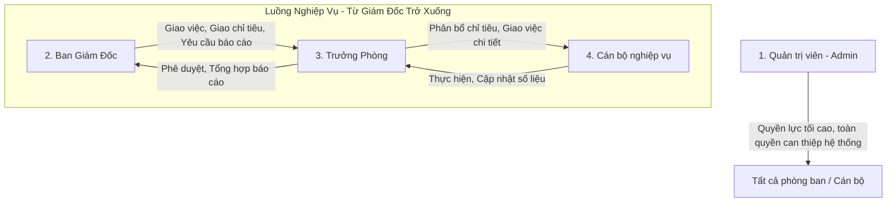

# TỜ TRÌNH DỰ ÁN
## HỆ THỐNG QUẢN TRỊ HIỆU SUẤT & THÔNG TIN BÁO CÁO TỰ ĐỘNG (workFlow)
---
**Kính gửi:** Ban Giám Đốc
**Người trình bày:** Quản lý Dự án
**Mục tiêu:** Báo cáo giải trình tính năng, logic xử lý kỹ thuật và đề xuất xin phê duyệt kinh phí mở rộng dự án **workFlow** áp dụng toàn diện trên quy mô tổng thể.

---

### I. ĐẶT VẤN ĐỀ & SỰ CẦN THIẾT CỦA DỰ ÁN
Trong bối cảnh chuyển đổi số ngành Tài chính - Ngân hàng diễn ra mạnh mẽ, việc quản lý công việc và báo cáo bằng các phương pháp thủ công (Email, Zalo, Excel) bộc lộ nhiều điểm hạn chế nghiêm trọng:
*   **Thất thoát thông tin:** Báo cáo bị trôi, quên hạn hoàn thành (SLA).
*   **Trì trệ tiến độ:** Ban Giám đốc không thể theo dõi thời gian thực (Real-time) tiến độ hoàn thành các chỉ tiêu kinh doanh (KPIs).
*   **Quá tải dữ liệu:** Rác thông báo và các tác vụ cũ đã hoàn thành làm chậm hệ thống và gây nhiễu giao diện làm việc của cán bộ nghiệp vụ.

Hệ thống **workFlow** ra đời nhằm giải quyết triệt để các bài toán trên thông qua nền tảng quản trị thông minh, tinh gọn, tốc độ cao và tự động hóa tối đa.

---

### II. KIẾN TRÚC VAI TRÒ & PHÂN QUYỀN HỆ THỐNG (ROLE MATRIX)
Hệ thống được thiết kế theo phân cấp chặt chẽ để đảm bảo tính bảo mật dữ liệu ngân hàng, đồng thời tối ưu hóa luồng phê duyệt:

#### 1. Nguyên tắc phân quyền đặc biệt:
*   **Quyền tối cao của Admin (Quản Trị Viên):** Admin là vai trò đặc biệt nằm ngoài luồng nghiệp vụ thông thường. Admin có quyền **xem, sửa, xóa, phân công và thực hiện tất cả mọi việc** trong hệ thống mà không bị giới hạn bởi phòng ban hay cấp bậc. Điều này giúp hỗ trợ kỹ thuật và xử lý các sự cố khẩn cấp tức thời.
*   **Luồng nghiệp vụ chuẩn:** Chỉ áp dụng ràng buộc **từ cấp Ban Giám Đốc trở xuống** (Director -> Manager -> Staff) để đảm bảo tuân thủ đúng quy trình tác nghiệp của đơn vị.
*   **Bảo mật dữ liệu phòng ban (Data Isolation):** Các Trưởng phòng và Cán bộ chỉ nhìn thấy các công việc, chỉ tiêu KPIs trực thuộc phòng ban của mình, ngoại trừ các chỉ tiêu do Admin/Ban Giám Đốc chỉ định dùng chung toàn hệ thống.

---

### III. CÁC TÍNH NĂNG ĐỘT PHÁ & LOGIC XỬ LÝ KỸ THUẬT

#### 1. Tính năng Phân phối Báo cáo Đa Phòng ban Song song (Multi-Department Assignment)
*   **Nghiệp vụ thực tế:** Khi Ban Giám đốc ban hành một yêu cầu báo cáo định kỳ (Ví dụ: Báo cáo dư nợ tuần), họ cần giao việc này cho nhiều phòng ban cùng lúc (Phòng Bán lẻ, Phòng Doanh nghiệp, Phòng Quản lý rủi ro).
*   **Logic xử lý kỹ thuật:** 
    *   Hệ thống cung cấp giao diện đa chọn phòng ban thông minh (Multi-select Popover) hiển thị dưới dạng các Badge màu sắc trực quan.
    *   Khi người dùng bấm "Gửi yêu cầu", hệ thống tự động chạy vòng lặp ngầm (Loop) để quét và tìm kiếm các **Trưởng phòng (Manager)** làm cán bộ tiếp nhận của từng phòng ban đã chọn.
    *   Hệ thống thực hiện **Tạo song song các bản ghi (Task) độc lập** trên database cho từng phòng ban.
    *   **Ý nghĩa:** Tiến độ thực hiện và dữ liệu báo cáo của từng phòng ban được cô lập hoàn toàn, tránh việc đè dữ liệu lên nhau, giúp Ban Giám đốc dễ dàng đánh giá và chấm điểm SLA chuẩn xác cho từng đơn vị.

#### 2. Cơ chế Tự động Lưu trữ & Dọn dẹp Thông minh (Auto-Archive & Cleanup)
Để tránh tình trạng phình to cơ sở dữ liệu làm chậm ứng dụng và gây rối mắt người dùng, hệ thống tích hợp sẵn tiến trình dọn dẹp ngầm tự động:
*   **Tự động Lưu trữ (60 ngày):** Khi một công việc/báo cáo được chuyển sang trạng thái "Đã hoàn thành" hoặc "Đã đóng", sau đúng **60 ngày**, hệ thống tự động kích hoạt cập nhật trạng thái `is_archived = true`. Các công việc này sẽ được ẩn hoàn toàn khỏi danh sách làm việc hàng ngày của cán bộ nhưng vẫn được bảo toàn để truy xuất khi xuất file lịch sử hoặc bộ lọc nâng cao.
*   **Tự động Xóa thông báo (30 ngày):** Các thông báo (Notifications) sau khi đọc hoặc tồn tại quá **30 ngày** sẽ bị xóa cứng (Hard Delete) khỏi database để giải phóng tài nguyên.
*   **Logic xử lý kỹ thuật:**
    *   Được cài đặt bằng hàm thủ tục lưu trữ SQL (Stored Procedure) chạy trực tiếp trong nhân cơ sở dữ liệu để tối ưu tốc độ.
    *   Kích hoạt an toàn thông qua cổng RPC của API mỗi khi giao diện chính được tải (Background Execution), không gây gián đoạn hay giảm trải nghiệm người dùng.

#### 3. Quản lý KPIs & Chỉ tiêu Kinh doanh Trực quan
*   Hỗ trợ thiết lập chỉ tiêu số cụ thể (Ví dụ: Giao chỉ tiêu huy động 50 tỷ đồng).
*   Thanh tiến độ (Progress Bar) chia làm 6 nấc tự động cập nhật theo số liệu thực tế cán bộ nhập lên.
*   Hiển thị **Ưu tiên hàng đầu (Top Focus)** trên Dashboard giúp cán bộ luôn bám sát chỉ tiêu quan trọng nhất trong tuần/tháng.

#### 4. Giao diện Dashboard Trực quan Cao cấp (Premium UX/UI)
*   Sử dụng phong cách thiết kế **Bold Minimalism (Tối giản Tinh tế)** phối hợp các tông màu tài chính đáng tin cậy (Navy Deep + Gold Accent).
*   Gom gọn 3 nhóm chỉ số cốt lõi (Năng suất tuần, Đang xử lý, Tiến độ kế hoạch) thành **một hàng ngang gọn gàng** theo đúng tiêu chuẩn thiết kế tài chính cao cấp.
*   Trang bị các hiệu ứng tương tác vi mô (Micro-animations): xoay nhẹ icon khi hover, thanh tiến độ phát sáng nhẹ (`shadow-primary-glow`), tạo cảm giác ứng dụng chuyên nghiệp và cực kỳ cao cấp.

---

### IV. HIỆU QUẢ KINH TẾ (ROI) & GIÁ TRỊ CHO DOANH NGHIỆP

| Chỉ số đánh giá | Trước khi áp dụng workFlow | Sau khi áp dụng workFlow | Hiệu quả cải thiện |
|:---|:---|:---|:---|
| **Thời gian giao việc & báo cáo** | 30 - 45 phút / tác vụ (Viết email, đính kèm, xác nhận) | **Dưới 1 phút** (Chọn phòng ban, gửi song song) | **Tiết kiệm 95% thời gian** |
| **Theo dõi tiến độ chỉ tiêu** | Cuối tháng họp mới nắm được số liệu thực tế | **Thời gian thực (Real-time)** 24/7 trên Dashboard | **Ra quyết định nhanh hơn 30 ngày** |
| **Tỷ lệ trễ hạn báo cáo (SLA)** | 15% - 20% do trôi tin nhắn, quên việc | **Gần như 0%** nhờ hệ thống nhắc nhở thông minh | **Cam kết SLA tuyệt đối** |
| **Chi phí in ấn, lưu trữ giấy** | Cao (Báo cáo giấy, ký duyệt tay) | **0 đồng** (Phê duyệt số hoàn toàn) | **Bảo vệ môi trường, tiết kiệm chi phí** |

---

### V. ĐỀ XUẤT XIN DUYỆT KINH PHÍ MỞ RỘNG (PROPOSAL)
Để đưa hệ thống **workFlow** vào hoạt động chính thức và phủ sóng rộng rãi cho toàn thể cán bộ nhân viên, chúng tôi kính trình Ban Giám Đốc phê duyệt các nội dung sau:

1.  **Phê duyệt giải pháp công nghệ:** Chấp thuận kiến trúc kỹ thuật và luồng nghiệp vụ hiện tại của hệ thống.
2.  **Phê duyệt kinh phí triển khai mở rộng:**
    *   *Chi phí hạ tầng Server & Cơ sở dữ liệu đám mây (Supabase / AWS):* Dự kiến **[Nhập số tiền] / năm**.
    *   *Chi phí bản quyền và vận hành:* Dự kiến **[Nhập số tiền]**.
3.  **Kế hoạch thực hiện:**
    *   **Tuần 1:** Cấu hình môi trường sản xuất (Production Environment) và kiểm thử an toàn thông tin dữ liệu.
    *   **Tuần 2:** Tổ chức đào tạo trực tuyến hướng dẫn sử dụng cho các Trưởng phòng và Cán bộ nghiệp vụ.
    *   **Tuần 3:** Khởi chạy chính thức (Go-live) toàn đơn vị.

Kính trình Ban Giám Đốc xem xét và phê duyệt./.
